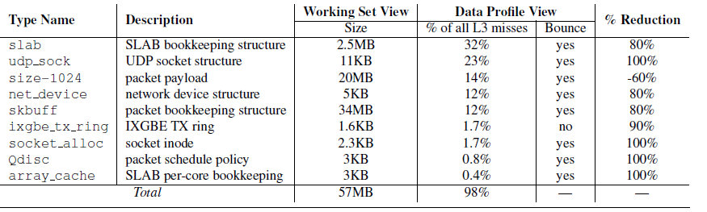
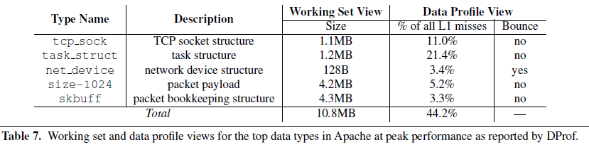
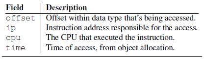

# Report for 'Locating Cache Performance Bottlenecks Using Data Profiling'
传统的检测代码运行瓶颈的工具需要与特定的代码位置关联，本文提提出的DProf将缓存未命中与数据类型相关联，并提出了新的数据分析概念与方法，最后将DProf与其他的代码检测工具对比，通过两个检测瓶颈并修正的case证明了DProf提出的瓶颈检测方法是切实可行的。

## Summary of major innovations 
本文提出了一种新的分析cache访问瓶颈的数据分析方法DProf，将缓存未命中问题同数据及其类型结合起来，可以使分析人员定位代码中容易导致缓存缺失的部分。缓存未命中可以分为多种情况，DProf可以帮助正确识别不命中的类型，发现原因并帮助消除造成不命中的原因。其主要方法是使用性能检测硬件收集正在运行的软件对内存地址的引用，通过对比分析地址引用数据对缓存不命中进行分类。在此基础上识别不命中的数据类型，并给出分析图表。

在主要实现方面，DProf构造了两种实现功能的关键数据：
1. 路径追踪（path traces）,记下一个数据对象从分配空间到释放的过程，读写的指令序列等。通过从CPU性能监控硬件中采集原始数据，DProf将路径跟踪集中在一起。一种是访问实例（access sample，记录了内存引用指令的信息），一种是对象访问历史（object access history，读写特定数据对象的指令集合）。
2. 地址集（address set），包括了运行中分配的所有对象的地址和类型，将其与cache中特定的关联集做映射。通过检测分配器来记录所有对象的分配和释放指令及其类型信息来构造地址集。

利用这些数据可以生成上述的各种分析图表。

最后，使用了DProf在Linux2.6.30内核下对两个工作负载，Apache和memcached，进行检查，寻找缓存问题。并同OProfile对比。

## What the problems the paper mentioned?
其一是提出DProf的实际需求，以往的瓶颈检测工具只能对代码进行检查，分析代码中哪部分会造成大量的cache miss，DProf将cache miss同数据类型联系起来。

其二是如何直观地分析因数据类型导致的cache miss，在此基础上，如何获取到分析表格需要的运行时数据（path traces和address set）。

## How about the important related works/papers?
文章中提及了一些相关工作，如下：
代码分析统计工具Gprof，它是GNU编译器工具包所提供的一种剖析工具GNU profiler（gprof）。gprof 可以为 Linux平台上的程序精确分析性能瓶颈，精确地给出函数被调用的时间和次数，给出函数调用关系。http://sourceware.org/binutils/docs-2.17/gprof/index.html

OProfile：是Linux平台上的一个功能强大的性能分析工具，支持两种采样(sampling)方式：基于事件的采样(eventbased)和基于时间的采样(timebased)，它可以工作在不同的体系结构上，包括MIPS、ARM、IA32、IA64和AMD。

MemSpy：定位缓存访问低效的部分代码，可以分析每次缓存未命中。

VTune：可视化性能分析器（Intel VTune Performance Analyzer）是一个用于分析和优化程序性能的工具，作为Intel为开发者提供的专门针对寻找软硬件性能瓶颈的一款分析工具，它能确定程序的热点（hotspot），找到导致性能不理想的原因，从而让开发者据此对程序进行优化。

文中还提及了PTU（Performance tuning utility），它只将地址与静态内存关联，但DProf可以将动态内存也纳入考虑。

## What are some intriguing aspects of the paper?
1. 提出了一种新思路，将性能分析同代码的数据类型结合起来，并将DProf收集到的信息进行分析使cache miss得以分类处理。
2. 给出了四种展现结果的方式：

    Data Profile可以展示数据类型遇到cache miss的比例，针对多核的情况，哪种数据类型在多个核之间不停“转换”，可以针对这种cache miss对算法进行优化，使一个对象能在本地完成整个生命周期。
    

    Miss Classification：对每个数据类型哪种miss比例最多，可以针对特定的miss进行优化。

    Working Set：可以翻译为工作集，表明了哪些数据类型是比较活跃的，这种全局的缓存信息对追踪特定的miss非常重要，不同的数据元素在cache中可能相互驱逐，产生“抖动”。下图也是一个综合了data profile和working set的表格。
    
    文中提到利用这个工作集可以发现是否**一次使用了太多的特定类型的数据项**。

    Data Flow：展现了使用特定类型的对象的最常见函数序列。

3. 在未命中分类（Miss Classification）中，介绍了N路组相连，当软件频繁访问M(M>N)个不同的行，但是这M个行都映射到一个关联集上时，会发生miss，在平常的工作中很少会考虑这种性能损失，不过这是非常重要的优化途径。

4. DProf使用从硬件采样的方法将路径追踪（path trace）拼接在一起，有两种原始数据：
    access samples：收集以下信息。它使用了IBS进行收集，这涉及了硬件特性，可以对CPU运行进行详细的采样。
    

5. 对数据类型的处理。分为静态和动态两种，静态分配的内存可以在debug信息中找到其基址，对动态分配的内存，修改了分配器，可以对分配的对象进行追踪，并探索将数据类型与动态分配的内存地址进行绑定。

6. DProf使用了**debug寄存器**监听数据对象并将访问历史记录下来。并且DProf自动选择监听的对象，一般是在访问采样中最经常出现的对象。等待内核的内存分配器对其分配内存后，DProf使用debug寄存器进行追踪，直至这个对象被free。

## How to test/compare/analyze the results?
本文中，对DProf进行了测试分析，将其与另一种性能分析工具进行对比，并在Linux中实际分析了两种应用，查找其缓存性能问题。

## If you write this paper, then how would you do?
本文对cache miss的分类、DProf的原理、运行过程及其测试进行了详细的说明，但是如果能在实现细节上进行分析，或者描述如何针对具体应用使用DProf进行分析并改进应用可能会对学习者更加友好。

## Give the survey paper list in the same area.
Intel测试工具：
1. Intel. PTU, January 2010. http://software.intel.com/en-us/articles/intel-performance-tuning-utility/
2. Intel. VTune, January 2010. http://software.intel.com/en-us/intel-vtune/

文中提到的一些测试工具：
1. T. E. Anderson and E. D. Lazowska. Quartz: A tool for tuning parallel program performance. SIGMETRICS Perform. Eval. Rev., 18(1):115–125, 1990
2. S. L. Graham, P. B. Kessler, and M. K. Mckusick. Gprof: A call graph execution profiler. In Proceedings of the 1982 SIGPLAN Symposium on Compiler Construction, pages 120–126, Boston, MA, 1982.
3. J. Levon et al. Oprofile, January 2010. http://oprofile.sourceforge.net/
4. A. R. Lebeck and D. A. Wood. Cache profiling and the SPEC benchmarks: A case study. IEEE Computer, 27:15–26, 1994.
5. M. Martonosi, A. Gupta, and T. Anderson. Memspy: Analyzing memory system bottlenecks in programs. In Proceedings
of the ACM SIGMETRICS Conference on Measurement and Modeling of Computer Systems, pages 1–12, 1992.
