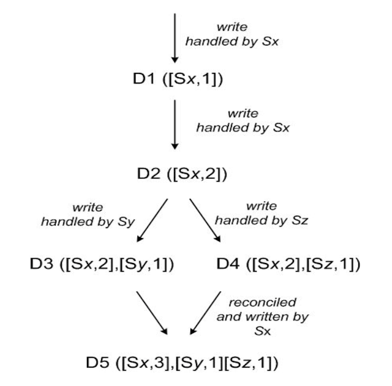

# Report for 'Dynamo: Amazon’s Highly Available Key-value Store'
Dynamo是Amazon根据自身业务需求提出，并实际应用到业务中的一个高可扩展且高度可靠的分布式键值存储系统。本文描述了Dynamo如何实现在可用性（availability），一致性（consistency）和性能（performance）之间的权衡，并解释了系统用到的各种技术，比如一致性散列、矢量时钟、Merkle树，基于gossip的失败检测协议等。本文内容丰富，提出了很多基于实际业务场景的高效手段。

## Summary of major innovations
1. Amazon的服务是高度分散、低耦合且基于服务的，这就对存储可用性提出了要求，且传统的关系型数据库不能达到所要求的高效。Dynamo是一个具有高可用性和高可扩展性的分布式“键-值”数据存储系统，它提供了一种“永远在线”的服务，为了达到高度的可用性，Dynamo在某些错误场景中将牺牲部分一致性。

2. 它假定系统对特定数据项的读写只是通过一个主键（key）标识的，没有对多个数据项的操作，也不需要关系型数据库数据项之间的复杂关系。这个假定基于一部分的Amazon应用使用简单的查询即可，并不需要任何关系模式，且需要存储的对象都比较小(通常小于1MB)。

3. 数据使用一致性哈希来分开存储，多个副本之间的一致性通过分散同步复制协议实现。在网络故障时，强一致性和高可用性不可能性同时实现。通过积极复制实现高可用性，但它会导致更改冲突。Dynamo被设计成最终一致性(eventually consistent)的数据存储，即所有的更新操作，最终达到所有副本。同时由于服务的特点，将解决冲突的复杂性转移给读，确保永远可写。

4. 系统具有高度灵活性，可以通过配置实现增删节点，以满足对峰值性能的需要；或通过修改参数满足对可用性和一致性不同的需要，且达到延时和吞吐量的要求。

5. 在服务中的各个数据库实例都遵守服务保证条约（SLA），在Amazon的服务平台上，每个模块都要为其使用者提供服务时间保证，确保提供符合性能协议的服务，从而使整个数据平台在规定的性能要求下运转。同时，设计中考虑由服务决定系统属性，让服务在性能和开销之间进行权衡，以满足服务的需要。

## What the problems the paper mentioned?
首先，Amazon的服务要求不一，且请求高峰时需要灵活扩容，因此配置上的灵活性需要考虑；服务要求高可用性，对用户的请求必须做到快速高效的响应，且是针对“所有用户”，因此需要实现可用性的保障。

如何实现增量式的扩展和节点分区，使在扩容后各个节点的负载能够保持均衡，同时避免迁移大量的数据，尽可能减少对现存数据的影响。

分布式的数据存储需要解决的一个问题就是各个节点的同步和冲突处理，由于网络原因或用户的操作，可能会出现一个数据项的多个版本，如何实现在高可用性和快速响应下的最终一致性并保证在并发和网络断开等错误条件下的冲突解决，并解决何时协调冲突，哪个节点实现协调。

在进行get和put操作时，如何进行调度，如何对数据项的分布进行分配，如何对请求进行响应，如何确定所执行的操作是返回了正确的结果。

故障检测和处理是分布式存储系统的需要解决的重点和难点，尤其是对于像Dynamo这种要求高可用性的系统。

## How about the important related works/papers?
因为Dynamo是不开源的，所以出现了根据本篇论文实现的Riak，它也是一个最终一致性的键/值存储系统。https://docs.riak.com

文章列举了一些P2P文件共享系统，如Freenet和Gnutella，简介了它们面对多次查询时的挑战，比如查询请求是如何被转发到每个节点的；为了解决冲突，Oceanstore在引起冲突的更新中为其排序，并按照顺序原子性的执行。文档https://oceanstore.cs.berkeley.edu/。Coda和Ficus两个通过系统级的冲突解决，确保了最终的一致性。

Merkle, R等人的“A digital signature based on a conventional encryption function”是关于文中使用的Merkle 
Tree的，在p2p和可信计算中都有应用。

## What are some intriguing aspects of the paper?
本文提出了一些非常有效的解决问题的方法：

1. 首先，本文放弃了关系型数据库的思想，也放弃了其复杂的对象之间的关系和约束，不再追求高一致性，而是构建了一个牺牲部分一致性但是实现了高可用性的“键-值”存储系统。

2. 使用虚节点思想解决扩容问题。首先提到的是根据资源的哈希值对数据进行分布。但是当资源数变化或者分布不均时，其分布方式都可能变化，同时也没有考虑节点执行中的异质性。因此提出了虚节点的概念，一个实际的节点对应多个虚节点。这样在某节点故障时将其负载更加平均的分散到其他节点，也可以根据节点容量确定其对应的虚点个数，更好地支持异质性。

3. 本文保证了写操作的高可用性（Always Writeable），这样就不可避免地牺牲了数据的一致性。Dynamo没有对数据做强一致性要求，而是要求“最终一致性(eventual consistency)”。Dynamo中将每一次操作的结果都作为一份全新的数据保存，造成了一份数据会在不同的节点存在多个版本，使用Vector Clock进行合并。一个Vector Clock可以理解为一个`pair<节点编号，计数器>`的列表，每一个版本的数据都有一个Vector Clock。通过对比两个数据的Vector Clock就能发现他们之间的亲缘关系，从而判断是否进行合并。

4. 使用了一个一致性协议，通过三个参数N、W和R，N代表N个备份，W代表要写入至少W份才认为成功，R表示至少读取R个备份。配置的时候要求W+R > N。这样的话每次读取都至少读取到一个最新的版本，至少有一个节点会被读操作和写操作同时操作到。可以根据需要的环境灵活配置，如高可写的环境可以配置W = 1 如果N=3 那么R = 3，写任一节点成功就认为成功，但是读的时候必须从所有的节点都读出数据。通过调整R和W能实现available和consistency之间的转换。

5. 使用Hinted Handoff来避免节点临时掉线故障。如果节点A故障，那么写到A上的副本就会被发送到D上，D中记录这个副本的元信息（MetaData）标明这份数据是A的。D如果检测到A上线，就会将这个副本回传给A，之后删除这份数据。

6. 使用Merkle树进行检测不一致，独立地检查树的每个分支，而无需节点下载整个树或整个数据集，这有助于减少需要传输的数据量，同时检查副本之间的不一致性。

7. 采用基于Gossip的节点变化广播，将节点加入或离线信息及其他分配信息传递给集群内的所有节点，并将因此产生的负载变化在全部节点之间统一分配。

## If you write this paper, then how would you do?
本文对系统中为实现高可用性所做的工作进行了详细介绍，也对系统实际应用中的情况进行了讨论。也可以在文中针对一个具体的业务场景，详细描述系统在遇到各种特殊情况时的应对方案。其次，可以添加在不同条件下的压力测试和响应时间测试数据，展现其对请求的响应能力。

另外，文中没有对提到的“牺牲一致性”的场景和具体表现进行叙述，尽管在Amazon的业务场景下可以牺牲一部分一致性，但是如果在文中对一致性进行评估的话更有利于之后的改进工作。

## Give the survey paper list in the same area.
Bigtable: A Distributed Storage System for Structured Data。这篇文章是Google针对大规模数据分布式存储所做的研究，与本文结合看可以发现针对不同业务场景作出的不同选择。与本文不同的是Bigtable是针对的结构化数据（structured data）。

Managing update conflicts in Bayou, a weakly connected replicated storage system 本文主要介绍了在Bayou中是如何解决更新过程中的不一致性问题的。

Storage management and caching in PAST, a large-scale, persistent peer-to-peer storage utility.介绍了如何在PAST中实现存储管理和副本的分布式管理。

Coda: a highly available file system for a distributed workstationenvironment. Coda是由Unix工作站组成的大规模分布式计算环境的文件系统，它通过使用两种不同但互补的机制为服务器和网络故障提供弹性的服务。

Resolving File Conflicts in the Ficus File System. Ficus旨在在各种规模和网络环境中提供文件服务，并发控制提供快速的本地访问和高可用性的文件系统，以便在断开连接时进行更新。